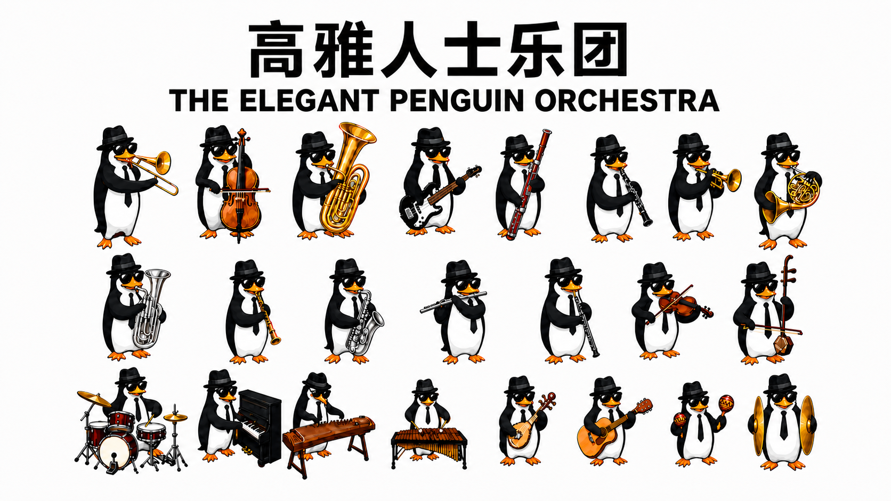

# Elegant Penguin Orchestra

[中文](#中文) | [English](#english)

## 中文

### 项目简介

**高雅人士乐团**是一套为 **Codex Desktop** 制作的像素风自定义 pet 合集。23 位统一造型的企鹅戴着礼帽、方框墨镜和领带，分别演奏一种乐器；每位成员都可以独立安装和选择。

第一阶段现已完成。当前版本收录 23 位成员，项目在此阶段暂告一段落。未来若继续扩充，将沿用相同的角色造型、动画规格与目录规范。

> 本项目提供的是 Codex Desktop 自定义 pet，不是 Windows 独立桌宠，也不包含单独运行的可执行程序。

### 乐团成员

| # | 成员 | 乐器 | Pet ID |
| ---: | --- | --- | --- |
| 1 | Saxophone Penguin | 萨克斯 | `saxphone` |
| 2 | Suona Penguin | 唢呐 | `suona` |
| 3 | Trombone Penguin | 长号 | `trombone` |
| 4 | Flute Penguin | 长笛 | `flute` |
| 5 | Violin Penguin | 小提琴 | `violin` |
| 6 | French Horn Penguin | 圆号 | `french-horn` |
| 7 | Clarinet Penguin | 单簧管 | `clarinet` |
| 8 | Bass Penguin | 贝斯 | `bass` |
| 9 | Cello Penguin | 大提琴 | `cello` |
| 10 | Tuba Penguin | 大号 | `tuba` |
| 11 | Baritone Horn Penguin | 次中音号 | `baritone-horn` |
| 12 | Liuqin Penguin | 柳琴 | `liuqin` |
| 13 | Piano Penguin | 钢琴 | `piano` |
| 14 | Guzheng Penguin | 古筝 | `guzheng` |
| 15 | Erhu Penguin | 二胡 | `erhu` |
| 16 | Trumpet Penguin | 小号 | `trumpet` |
| 17 | Drum Kit Penguin | 架子鼓 | `drum-kit` |
| 18 | Cymbals Penguin | 大镲 | `cymbals` |
| 19 | Marimba Penguin | 马林巴 | `marimba` |
| 20 | Maracas Penguin | 沙锤 | `maracas` |
| 21 | Oboe Penguin | 双簧管 | `oboe` |
| 22 | Bassoon Penguin | 巴松 | `bassoon` |
| 23 | Guitar Penguin | 吉他 | `guitar` |

> `saxphone` 是为兼容现有安装而保留的 Pet ID；乐器与展示名称使用正确拼写 Saxophone。

### 安装方法

1. 在仓库中选择一个 pet 目录，例如 `tuba/`。
2. 将整个目录复制到：

   ```text
   %USERPROFILE%\.codex\pets\<pet-id>
   ```

   例如大号 pet 的安装位置为：

   ```text
   %USERPROFILE%\.codex\pets\tuba
   ```

3. 打开 Codex Desktop 的 **Settings > Pets** 并选择刚安装的成员。
4. 如果列表没有刷新，请重启 Codex Desktop。
5. 在 Codex 任务中输入 `/pet`，唤出当前选择的 pet。

安装时只需要复制目标 pet 目录，不需要复制 `social/`。

### Pet 包结构

每种乐器对应一个独立目录。可运行的 pet 目录只包含两个文件：

```text
<pet-id>/
├── pet.json
└── spritesheet.webp
```

- 目录名必须与 `pet.json` 中的 `id` 一致。
- `pet.json` 保存显示名称、说明和图集路径。
- `spritesheet.webp` 是 Codex Desktop 直接加载的透明动画图集。
- `social/` 保存 README 横幅和小红书竖版封面，不参与 pet 运行。

### 动画图集规格

| 项目 | 规格 |
| --- | --- |
| 文件 | `spritesheet.webp` |
| 画布 | 1536 × 1872 |
| 格式 | 带透明通道的 WebP |
| 网格 | 8 列 × 9 行 |
| 单帧 | 192 × 208 |
| 有效帧 | 57 |

动作行从上到下固定为：

| 行 | 动作 | 帧数 |
| ---: | --- | ---: |
| 1 | `idle` | 6 |
| 2 | `running-right` | 8 |
| 3 | `running-left` | 8 |
| 4 | `waving` | 4 |
| 5 | `jumping` | 5 |
| 6 | `failed` | 8 |
| 7 | `waiting` | 6 |
| 8 | `running` | 6 |
| 9 | `review` | 6 |

未使用的网格单元和图集背景保持透明。

---

## English

### About

**Elegant Penguin Orchestra** is a pixel-art custom pet collection for **Codex Desktop**. Its 23 matching penguin performers wear fedoras, square sunglasses, and ties while each playing a different instrument. Every member is packaged as an independently installable pet.

Phase one is complete. This 23-member edition is the project's current stopping point. Any future additions will follow the same character design, animation specification, and directory convention.

> These are custom pets for Codex Desktop. They are not standalone Windows desktop pets and do not include a separately runnable executable.

### Orchestra Members

| # | Member | Instrument | Pet ID |
| ---: | --- | --- | --- |
| 1 | Saxophone Penguin | Saxophone | `saxphone` |
| 2 | Suona Penguin | Suona | `suona` |
| 3 | Trombone Penguin | Trombone | `trombone` |
| 4 | Flute Penguin | Flute | `flute` |
| 5 | Violin Penguin | Violin | `violin` |
| 6 | French Horn Penguin | French horn | `french-horn` |
| 7 | Clarinet Penguin | Clarinet | `clarinet` |
| 8 | Bass Penguin | Electric bass | `bass` |
| 9 | Cello Penguin | Cello | `cello` |
| 10 | Tuba Penguin | Tuba | `tuba` |
| 11 | Baritone Horn Penguin | Baritone horn | `baritone-horn` |
| 12 | Liuqin Penguin | Liuqin | `liuqin` |
| 13 | Piano Penguin | Piano | `piano` |
| 14 | Guzheng Penguin | Guzheng | `guzheng` |
| 15 | Erhu Penguin | Erhu | `erhu` |
| 16 | Trumpet Penguin | Trumpet | `trumpet` |
| 17 | Drum Kit Penguin | Drum kit | `drum-kit` |
| 18 | Cymbals Penguin | Crash cymbals | `cymbals` |
| 19 | Marimba Penguin | Marimba | `marimba` |
| 20 | Maracas Penguin | Maracas | `maracas` |
| 21 | Oboe Penguin | Oboe | `oboe` |
| 22 | Bassoon Penguin | Bassoon | `bassoon` |
| 23 | Guitar Penguin | Guitar | `guitar` |

> The legacy Pet ID `saxphone` is retained for compatibility with existing installations; the instrument and display name use the correct spelling, Saxophone.

### Installation

1. Choose a pet directory from the repository, such as `tuba/`.
2. Copy the entire directory to:

   ```text
   %USERPROFILE%\.codex\pets\<pet-id>
   ```

   For example, install the tuba pet at:

   ```text
   %USERPROFILE%\.codex\pets\tuba
   ```

3. Open **Settings > Pets** in Codex Desktop and select the installed member.
4. Restart Codex Desktop if the pet list does not refresh.
5. Enter `/pet` in a Codex task to summon the selected pet.

Only the selected pet directory is required for installation. The `social/` directory is not part of the runtime package.

### Pet Package Structure

Each instrument has its own directory. A runnable pet package contains only two files:

```text
<pet-id>/
├── pet.json
└── spritesheet.webp
```

- The directory name must match the `id` in `pet.json`.
- `pet.json` stores the display name, description, and spritesheet path.
- `spritesheet.webp` is the transparent animation atlas loaded by Codex Desktop.
- `social/` contains the README banner and Xiaohongshu portrait cover; it is not used at runtime.

### Animation Atlas Specification

| Item | Specification |
| --- | --- |
| File | `spritesheet.webp` |
| Canvas | 1536 × 1872 |
| Format | WebP with transparency |
| Grid | 8 columns × 9 rows |
| Frame | 192 × 208 |
| Populated frames | 57 |

Animation rows are fixed in this top-to-bottom order:

| Row | Action | Frames |
| ---: | --- | ---: |
| 1 | `idle` | 6 |
| 2 | `running-right` | 8 |
| 3 | `running-left` | 8 |
| 4 | `waving` | 4 |
| 5 | `jumping` | 5 |
| 6 | `failed` | 8 |
| 7 | `waiting` | 6 |
| 8 | `running` | 6 |
| 9 | `review` | 6 |

Unused cells and the atlas background remain transparent.
